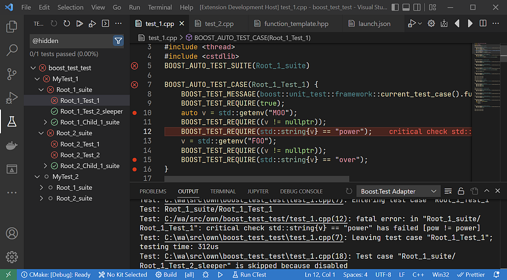

# Boost.Test Run/Debug
This extension allows you to run your [Boost.Test](https://github.com/boostorg/test) tests
from the Testing sidebar of VS Code.

## Screenshot


## Features
* Tests will appear in the Testing sidebar of VS Code.
* Automatically locate test executables using glob.
  * Tests should end in `_test`, or `_test.exe` for windows.
* ```run``` or ```debug``` tests 
  * from the ```Testing``` sidebar
  * from inside test source code
* Output
  * Test output appears in the `Test Output` Terminal of the Testing sidebar.
  * During debugging the test output appears in the corresponding Terminal.
  * Diagnostic info appears in the `Boost.Test Run/Debug` Output channel.

## Configurations

A configuration will automatically be created in the workspace settings using **glob**.
```json
    "boost-test-adapter-robaho.tests": [
        {
            // testExecutables must be provided
            "testExecutables": [
              {
                // either path or glob must be provided
				// path to a test executable. May be absolute or relative path.
                "path": "build/Debug/main_test_1",
                // Optional: Show this label in the Testing sidebar instead of the Boost Test module name.
                "label": "Test 1 (debug)"
              },
              {
                "path": "build/Release/main_test_1",
                "label": "Test 1 (release)"
              },
              {
                "path": "build/Debug/main_test_2"
              },
			  {
				// a glob can match multiple test executables
				"glob": "**/*{_test,_test.exe}",
			  }
            ],

            // Optional: The working directory for the test executables.
            "cwd": "${workspaceFolder}",

            // Mandatory: The name of a launch configuration that should be used
            // when debugging the tests.
            // The 'program' and 'args' options of the given launch config will
            // be overwritten by this extension.
            "debugConfig": "Test config",

            // Optional: A simple key=value file with environment variables for running and debugging the tests.
            "envFile": "${workspaceFolder}/.env",

            // Optional: Environment variables for running and debugging the tests.
            // These env vars are merged with the ones from envFile (if present).
            // These env vars take precedence over the ones from envFile.
            "env": [
              {
                "name": "MY_VAR",
                "value": "my var value"
              }
            ],

            // Optional: Used to convert relative source file paths to absolute paths.
            // It's needed only if the test-case file paths are broken in the Test Explorer UI.
            "sourcePrefix": "${workspaceFolder}"
        },
        {
            "testExecutables": [ "build/Debug/other_test_2" ],
            "cwd": "${workspaceFolder}",
            "debugConfig": "Test config"
        }
    ]

```

## FAQ
1. I don't see any tests in the Testing sidebar. Why?
   - Make sure you have configured your `settings.json` and `launch.json` properly.
     - Take a look at the `Boost.Test Run/Debug` Output channel for potential issues.
	 - The automatic configuration looks for test executables ending in `_test` or `_test.exe`
   - Press the reload button at the top of the Testing sidebar.
   - Restart VS Code.
2. What is this weird root node in the test tree?
   - That is your workspace name.
3. Why does the path of the tests change when I open them?
   - Tests are not loaded from the test execuatbles immediately. They are loaded only
     when requested (i.e. when you open them). At that point the Test Module name is fetched
     from the test executable and it replaces the test exe path.
     The test exe path is still available from the context menu's `Copy Path` command.
4. Why is the file system path of my Test Suite point to the *wrong* source file?
   - Probably because you have the same Test Suite declared in multiple source files.
5. Why is my test-root called "Hello World" (or some other nonsense) in the Testing sidebar?
   - That is the Boost test module name. It comes from your test executable.
     Usually from a line like this:
     ```
     #define BOOST_TEST_MODULE Hello World
     ``` 

## Features not implemented yet
- When debugging a test, the red/green status of the test is not updated in the UI.

## Credits
This extension is based on code from these extensions:
- https://github.com/feheren/vscode-boost-test-adapter
- https://github.com/firoorg/vscode-boost-test-adapter
- https://github.com/newdigate/vscode-boost-test-adapter.git

## Changelog
* Update 3.65
  * Ability to use **glob** to specify tests
  * Automatically create configuration if needed.
* Updates 3.4 - 3.6.4
  * Update icon.
  * Update marketplace metadata.
* Update 3.3.0
  * Fix handling of boost run errors that don't have parenthesis around the line number.
  * Fix handling of source paths. 
* Update 3.2.3
  * Add `Copy Path` and `Copy Relative Path` commands to the context menu.
  * Add `Copy Boost.Test ID` command to the conext menu. It allows to copy the Boost test ID (test path) of a
    test case or test suite to the clipboard for [test unit filtering](https://www.boost.org/doc/libs/1_80_0/libs/test/doc/html/boost_test/runtime_config/test_unit_filtering.html).
  * Bug fixes.
* Update 3.2.0
  * Use the built-in Test Explorer of VS Code. No need to install the external [Test Explorer UI](https://marketplace.visualstudio.com/items?itemName=hbenl.vscode-test-explorer) extension any more.
* Update 3.0.0
  * Add support for deeply nested test suites (multiple levels of test suites)
  * Add support for multiple test executables
  * Add support for cancelling tests
